# VideoSpeed - Cut, speed, and boomerang MP4 clips from the CLI


[-purple.svg)](https://github.com/cloudgen/ciao)
[](https://github.com/Wilgat/VideoSpeed)
[]()
[](https://pypi.org/project/VideoSpeed/)

VideoSpeed cuts a time range from an MP4, changes that clip’s length (percent), and can append a reverse pass (boomerang). On a terminal, no arguments opens a text menu (edit, language, system-log, self-management, Exit). Choosing edit walks through the prompts. Scripts pass `--file` / `--start` / `--end`. Encoding uses **FFmpeg**; duration probing uses **OpenCV**. The menu screen uses the default text-menu style: aligned number, verb, and note, and a rounded box along the bottom.

| You | The other role | Not this |
|-----|----------------|----------|
| Editor at a terminal or a script | FFmpeg on `PATH` (does the encode) | A website, installer, or root/sudo tool |

Package version SSOT: `src/VideoSpeed/__init__.py` (`MAJOR_VERSION`, `MINOR_VERSION`, `PATCH_VERSION` → **1.0.11**). `pyproject.toml` copies that string. Console entrypoint: `video-speed`.

## Features

- Recursive **MP4** discovery under a chosen folder
- Interactive **cut** (start/end seconds) with invalid-range re-prompt
- **Length/speed** change (**20–200%**) with A/V tempo kept in sync
- Optional **boomerang** (forward then reverse)
- **USB-safe** intermediate files (staged next to the output) and final publish via `shutil.move`
- **Text menu** on a terminal (`edit`, `language`, `system-log`, `self-management`, `Exit`): the first row keeps `Path` and the current directory on the left, and `Current` plus this login on the right when the row has room. Columns line up, and a three-row rounded input box sits on the bottom with a status line under it. The product name and version stay on that status line. **8 self-management** opens version, about, and the pip lifecycle rows. Hello is not a menu row
- **Product verbs** `help`, `version`, `about`, `hello`, `edit`, `list-mp4`, `self-install`, `version-check`, `self-update`, and `self-uninstall`. `help` prints the same usage as `--help`. `version` prints the installed version. `about` and `hello` print a page and do not ask for a folder or a file. `edit` on a terminal asks for the folder, then the file. `list-mp4` lists MP4 files and does not encode. `version-check` runs `python -m pip index versions VideoSpeed`. `self-update` runs `python -m pip install --upgrade VideoSpeed`. `self-install` runs `python -m pip install VideoSpeed`. `self-uninstall` runs `python -m pip uninstall -y VideoSpeed` and needs `--force` on the command line. `Exit` stays on the menu. `./build.sh` verbs such as `setup` are not `video-speed` verbs
- **`--help`** / **`--version`**; no arguments in a terminal opens that menu
- Non-interactive job: `--file`, `--start`, `--end`, optional `--percent` / `--boomerang`, with or without `edit`. Any of those selectors with no product verb skips the menu
- Fail-closed when **FFmpeg** is missing from `PATH`, when prompts are needed without a terminal, or when `--percent` or `--boomerang` is passed without a job

## Quick Installation

### Prerequisites (system)

- **FFmpeg** on `PATH` (`ffmpeg -version`)
- A supported **Python** environment (see `requires-python` in `pyproject.toml`)

### From PyPI (registry channel)

Package name SSOT: **`VideoSpeed`** (`pyproject.toml` `[project].name`). Maintainer verbs are on `./build.sh`: `help`, `version`, `setup`, `clean`, `build`, `test`, `test-install`, `upload`, `git`, `tag`, `release` (`all` is the same chain as `release`). `test` runs `tests/run.sh`. `test-install` reads `[project].name`, removes that pip install when present, and installs this checkout. Empty `./build.sh` prints help and does not upload.

```bash
pip install VideoSpeed
```

If the index is behind a local release, install from a checkout or wheel instead (below). Live index version is shown by the PyPI badge above.

### From a git checkout (development)

```bash
git clone git@github.com:Wilgat/VideoSpeed.git
cd VideoSpeed
pip install -e .
```

This installs the console script **`video-speed`** and pulls Python deps (`opencv-python-headless>=5.0.0.93`, `ChronicleLogger>=1.3.1`).

### Local pyenv install (testing)

```sh
./setup.sh
pyenv shell 3.14
video-speed --version
```

`setup.sh` runs `pyenv shell 3.14` and installs this checkout with pip into that interpreter. Install CPython 3.14 first when it is missing (`pyenv install 3.14`). Run `./setup.sh` again after source changes. In the shell where you want the command:

```sh
pyenv shell 3.14
video-speed --help
```

The console script is installed on the pyenv 3.14 prefix. `./setup.sh` changes that interpreter only. It does not install FFmpeg and it does not use root.

### From a local wheel / sdist

```bash
# after: python -m build   (or ./build.sh build)
pip install dist/VideoSpeed-1.0.11-py3-none-any.whl
# or
pip install dist/VideoSpeed-1.0.11.tar.gz
```

### Verify

```bash
video-speed --version
# or
python -m VideoSpeed --version
```

## Usage

Text menu (no arguments, in a terminal):

```bash
video-speed
# or
python -m VideoSpeed
```

The screen shows a numbered menu and a rounded input box along the bottom, as wide as the terminal, with one line to type on and a status line under the box. The first row keeps `Path:` and the folder on the left, and a local clock (`HH:MM:SS`) on the right when the row has room. The clock is drawn again each second. The product name and version stay on the status line. **edit** continues the prompts. **language** (4) opens the thirteen menu languages. The choice is kept for the next run. **system-log** (6) opens view-log, clear-log, and log-folder. **view-log** (61) lists the log files and shows the one you pick. **clear-log** (62) empties the file you pick after `Clear <name>? (y/n)`. **log-folder** (63) shows the log folder. **self-management** (8) opens version, about, version-check, self-update, self-uninstall, and self-install. **Exit** leaves. Hello is not on that menu.

The same actions are verbs. `edit` starts at the folder question. `list-mp4` asks for the folder when it is omitted, prints the numbered list, and stops. `version` prints the installed version and does not call pip. `version-check` and `self-update` call pip.

```bash
video-speed help
video-speed version
video-speed about
video-speed hello
video-speed edit
video-speed edit --folder ./clips
video-speed edit --file clip.mp4 --start 1 --end 5 --percent 100
video-speed list-mp4
video-speed list-mp4 --folder ./clips
video-speed version-check
video-speed self-update
video-speed self-install
video-speed self-uninstall --force
```

1. Folder containing MP4s (Enter = current directory)
2. Choose a video by number
3. Cut start/end seconds
4. New length percent (default 100; allowed 20–200)
5. Optional boomerang (y/n)
6. Output is written **next to the source** with a descriptive name

Non-interactive job (scripts / CI):

```bash
video-speed --file clip.mp4 --start 1 --end 5 --percent 100
video-speed --file clip.mp4 --start 1 --end 5 --percent 50 --boomerang
```

Other:

```bash
video-speed --help
video-speed --version
```

Without a terminal and without a job, the program exits with an error instead of hanging on prompts. `--percent` or `--boomerang` alone does the same and names `--file`, `--start`, and `--end`. `--folder` checks the directory. It does not pick a file.

`--json` keeps that same choice, closes the text menu, and prints one JSON object on standard output. On a terminal with no job flags, the questions are written to the error stream. Progress is not mixed into the object.

## Screenshots

Each heading is the file name. The paragraph is what that picture shows: the words on the screen, the characters in the input box, or the scene in the still.

### `language-menu.png`

Row **4** has opened the language list. **41 English** is highlighted, with the note “use English for this menu.” The other rows are **42 简体中文**, **43 繁體中文**, **44 Español**, **45 العربية**, **46 Français**, **47 Português**, **48 Русский**, **49 Deutsch**, **50 日本語**, **51 한국어**, **52 Nederlands**, and **53 Ελληνικά**. Each note says to use that language for this menu. **0 Back** says “return to the main menu.” The path label is `Path`, the clock is on the right, and the status line says `language`. VideoSpeed 1.0.11.

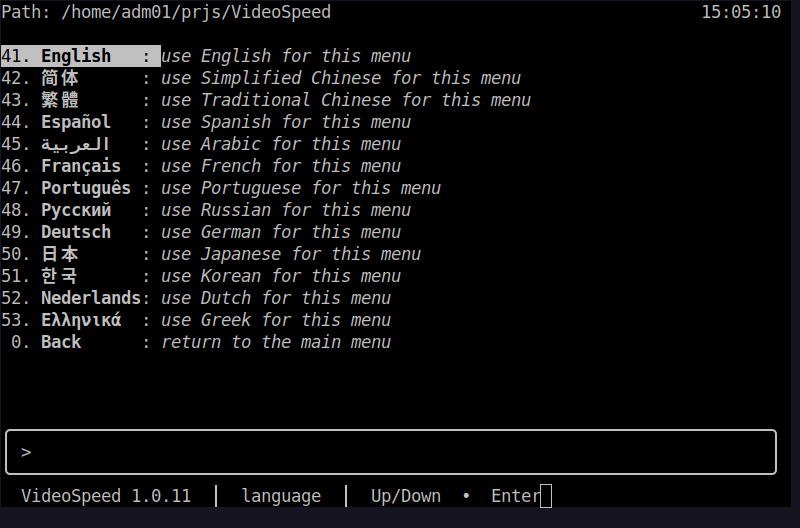

### `main-menu-en.png`

English main menu. There is no saved-language line above the box. The path label is `Path`. The rows are **1 edit** “cut, speed, and optional boomerang”, **4 language** “display language for this menu”, **6 system-log** “view, clear, and the log folder”, **8 self-management** “version, about, and pip lifecycle”, and **9 Exit** “leave.” The status line says `main menu`.

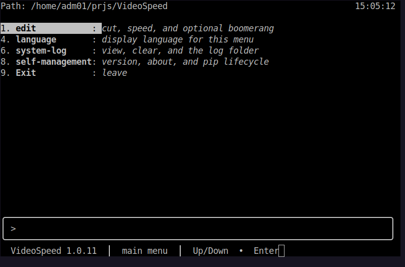

### `main-menu-zh-hans.png`

Simplified Chinese main menu. The line above the box says `菜单语言是简体中文`. The path label is `路径`. The clock’s last digit wraps onto the next line. Row **1** stays `edit`. Row **4** is `语言`, row **6** is `系统日志`, row **8** is `自我管理`, and row **9** is `离开`. The status line says `主菜单`.

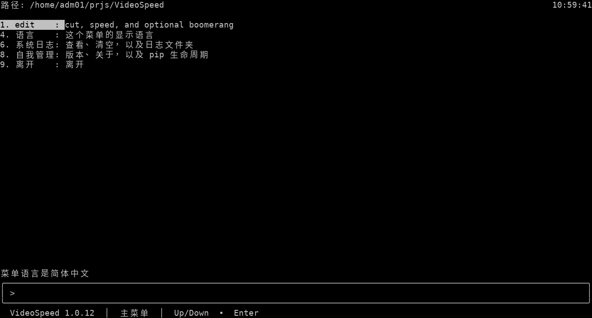

### `main-menu-zh-hant.png`

Traditional Chinese main menu. The line above the box says `選單語言是繁體中文`. The path label is `路徑`. The clock’s last digit wraps onto the next line. Row **1** stays `edit`. Row **4** is `語言`, row **6** is `系統日誌`, row **8** is `自我管理`, and row **9** is `離開`. The status line says `主選單`.

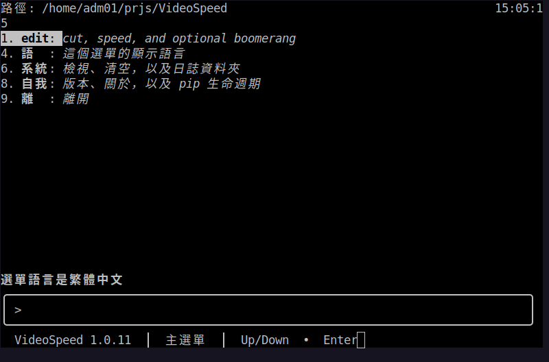

### `main-menu-es.png`

Spanish main menu. The line above the box says `El idioma del menú es español`. The path label is `Ruta`. Row **1** stays `edit`. Row **4** is `idioma`, row **6** is `registro`, row **8** is `autogestión`, and row **9** is `Salir`. The status line says `menú principal`.

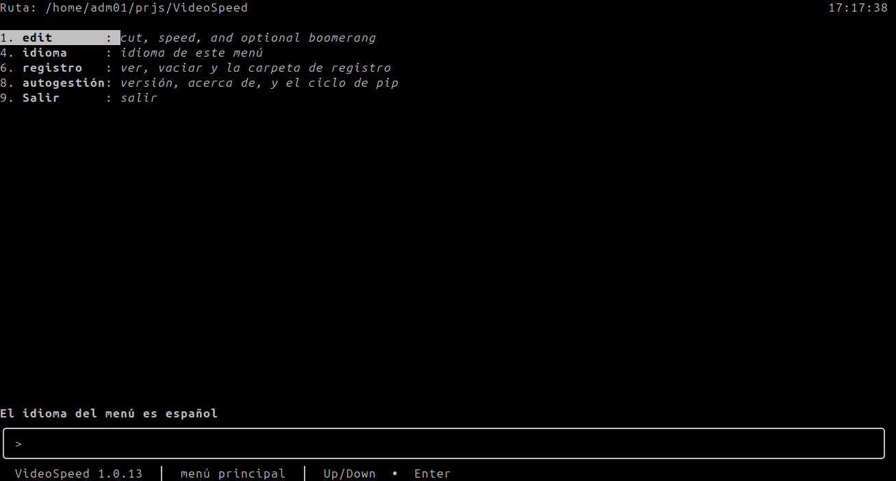

### `main-menu-ar.png`

Arabic main menu. The line above the box says `لغة القائمة هي العربية`. The path label is `المسار`. The row text runs right to left, so the columns do not sit like the English board. Row **1** stays `edit`. The status line says `القائمة الرئيسية`.

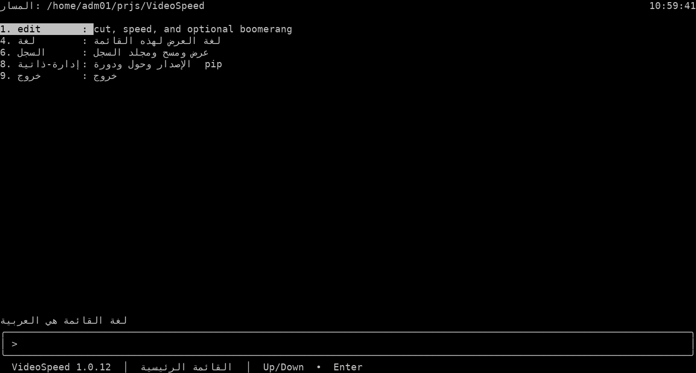

### `main-menu-fr.png`

French main menu. The line above the box says `La langue du menu est le français`. The path label is `Chemin`. Row **1** stays `edit`. Row **4** is `langue`, row **6** is `journal`, row **8** is `autogestion`, and row **9** is `Quitter`. The status line says `menu principal`.

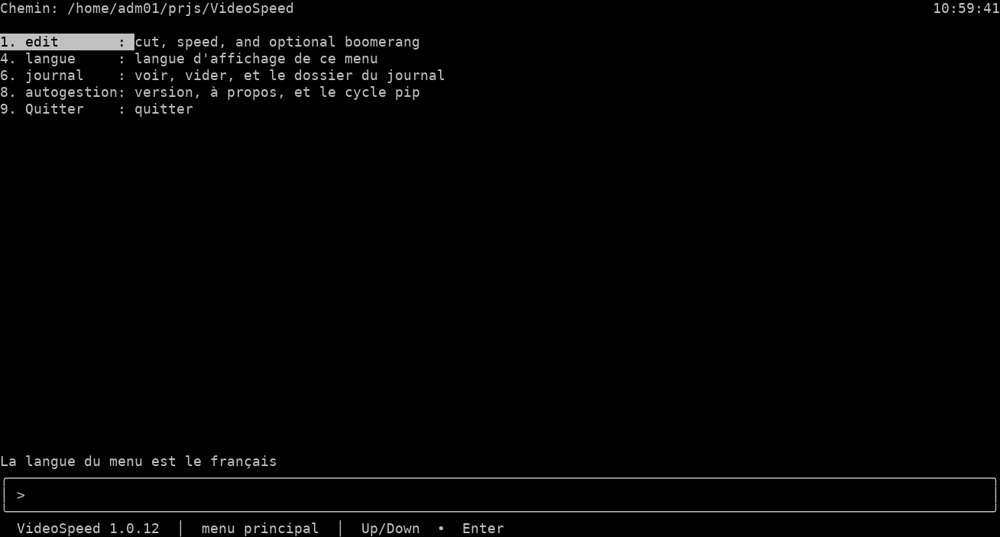

### `main-menu-pt.png`

Portuguese main menu. The line above the box says `O idioma do menu é português`. The path label is `Caminho`. Row **1** stays `edit`. Row **4** is `idioma`, row **6** is `registo`, row **8** is `autogestão`, and row **9** is `Sair`. The status line says `menu principal`.

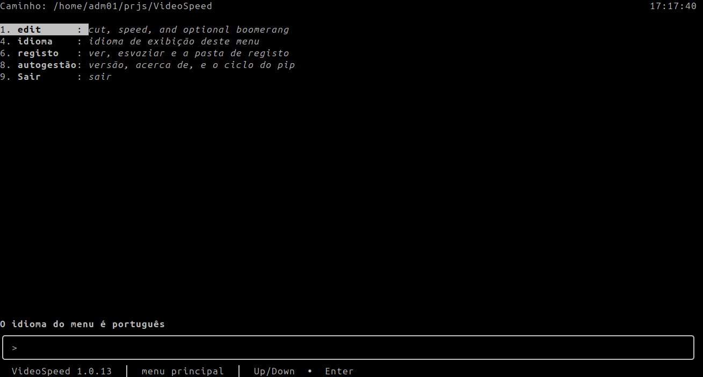

### `main-menu-ru.png`

Russian main menu. The line above the box says `Язык меню — русский`. The path label is `Путь`. Row **1** stays `edit`. Row **4** is `язык`, row **6** is `журнал`, row **8** is `самоуправление`, and row **9** is `Выход`. The status line says `главное меню`.

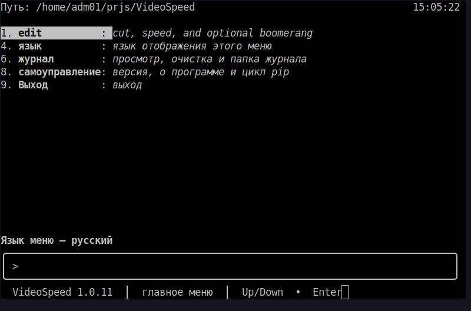

### `main-menu-de.png`

German main menu. The line above the box says `Die Menüsprache ist Deutsch`. The path label is `Pfad`. Row **1** stays `edit`. Row **4** is `Sprache`, row **6** is `Systemprotokoll`, row **8** is `Selbstverwaltung`, and row **9** is `Beenden`. The status line says `Hauptmenü`.

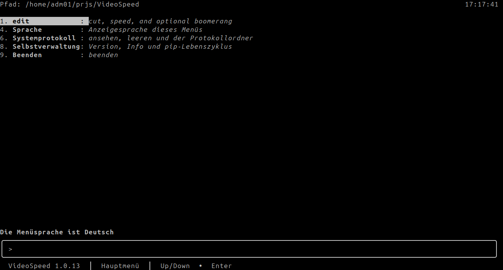

### `main-menu-ja.png`

Japanese main menu. The line above the box says `メニューの言語は日本語`. The path label is `パス`. The clock’s last digit wraps onto the next line. Row **1** stays `edit`. Row **4** is `言語`, row **6** is `システムログ`, row **8** is `自己管理`, and row **9** is `終了`. The status line says `メインメニュー`.

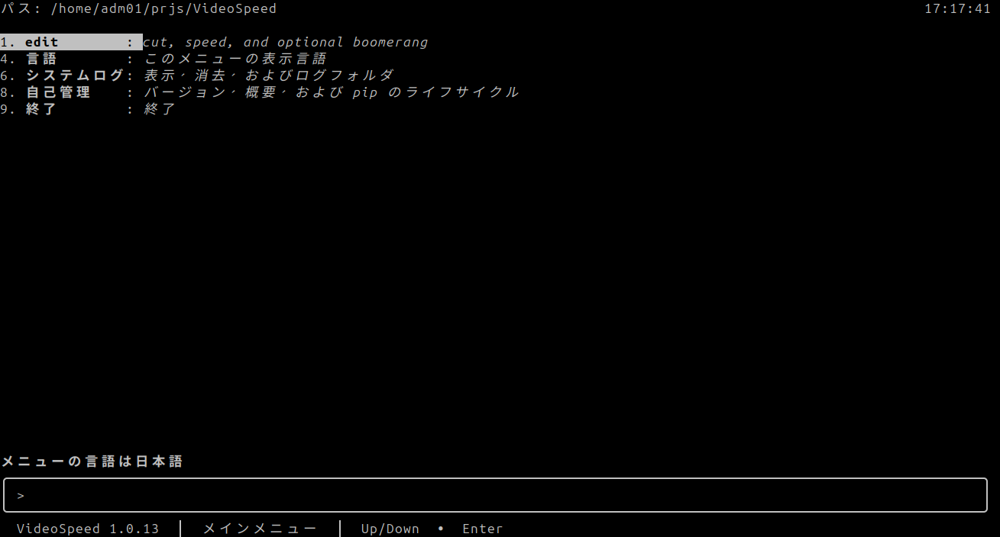

### `main-menu-ko.png`

Korean main menu. The line above the box says `메뉴 언어는 한국어`. The path label is `경로`. The clock’s last digit wraps onto the next line. Row **1** stays `edit`. Row **4** is `언어`, row **6** is `시스템-로그`, row **8** is `자기관리`, and row **9** is `종료`. The status line says `주 메뉴`.

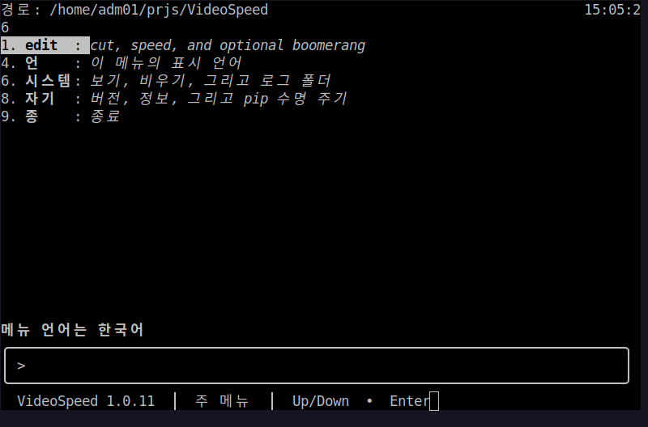

### `main-menu-nl.png`

Dutch main menu. The line above the box says `De menutaal is Nederlands`. The path label is `Pad`. Row **1** stays `edit`. Row **4** is `taal`, row **6** is `systeemlog`, row **8** is `zelfbeheer`, and row **9** is `Afsluiten`. The status line says `hoofdmenu`.

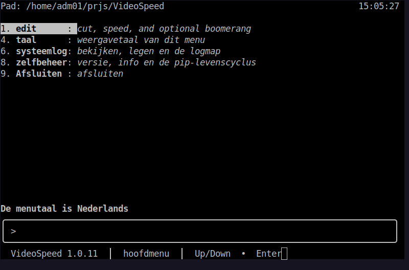

### `main-menu-el.png`

Greek main menu. The line above the box says `Η γλώσσα του μενού είναι ελληνικά`. The path label is `Διαδρομή`. Row **1** stays `edit`. Row **4** is `γλώσσα`, row **6** is `αρχείο-καταγραφής`, row **8** is `αυτοδιαχείριση`, and row **9** is `Έξοδος`. The status line says `κύριο μενού`.

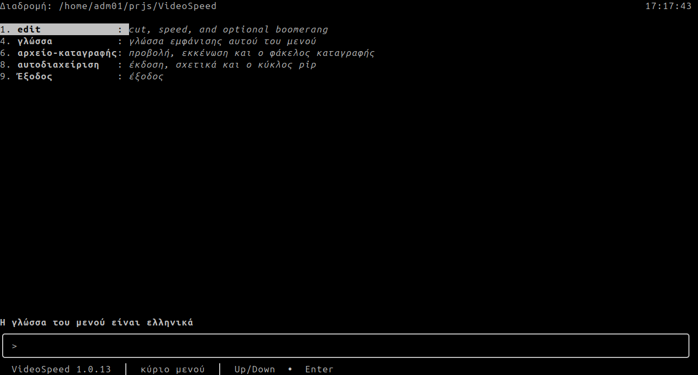

### `folder-menu.png`

Edit, first question. The title is `VideoSpeed (1.0.11) – edit`. The page says `Cut → Speed → Optional Boomerang` and `Esc returns to the menu.` The prompt is `Folder (Enter = current):`. The input box contains `sample-videos`. The status line says `edit`.

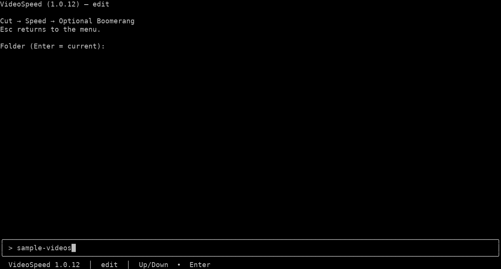

### `file-menu.png`

The folder listing inside edit. The page lists `1. video-1.mp4` and `2. video-2.mp4`, then `Choose video (1–2):`. The input box contains `1`.

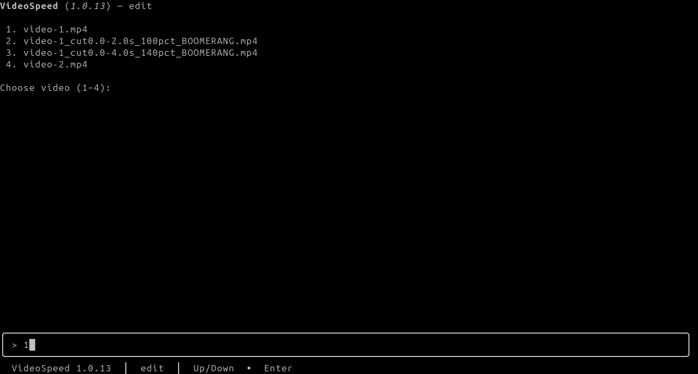

### `tui-input-star.png`

The file name is the start question (`star` for start). The page says `Selected: video-1.mp4` and `Duration: 00:18.042 (18.042s)`, then `Step 1/4 – Cut segment` and `Start seconds (default 0.0):`. The input box contains `0`.

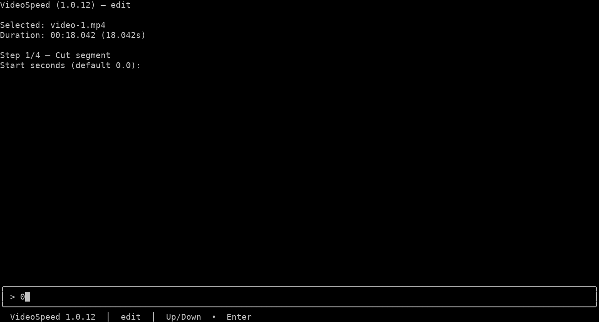

### `tui-input-end.png`

End of the cut. The page still shows `Selected: video-1.mp4` and `Duration: 00:18.042 (18.042s)`, then `Start: 0.000s` and `End seconds [18.042]:`. The input box contains `2`.

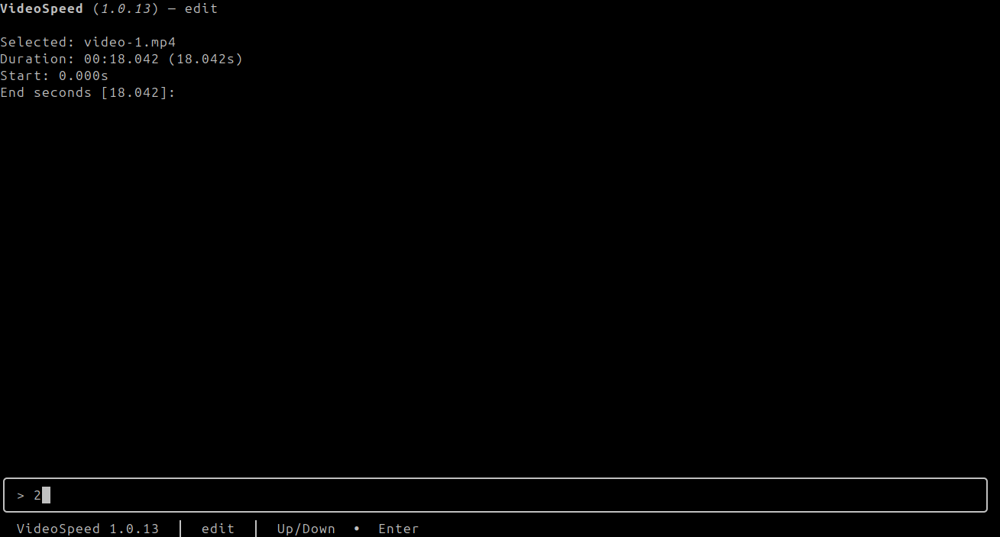

### `tui-length.png`

Length question. The page says `Step 2/4 – Resize length (20–200%)` and `New length % [100%]:`. The input box is empty, so the bracketed default **100%** stands. The status line says `edit`.

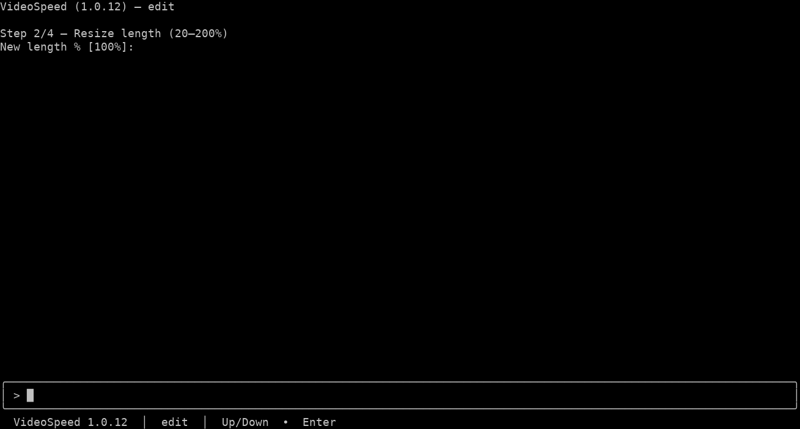

### `tui-boomerang-choice.png`

Boomerang question. The page says `Step 3/4 – Add boomerang effect?` and `Make it go forward + backward (y/n) [n]:`. The input box contains `y`.

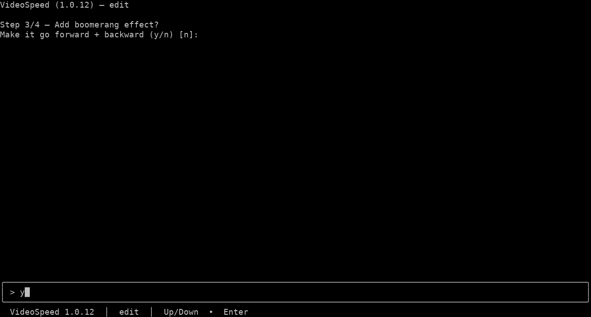

### `tui-video-done.png`

The encode has finished. The page says `Saved video-1_cut0.0-2.0s_100pct_BOOMERANG.mp4 – Again? (y/n):`. The input box is empty.

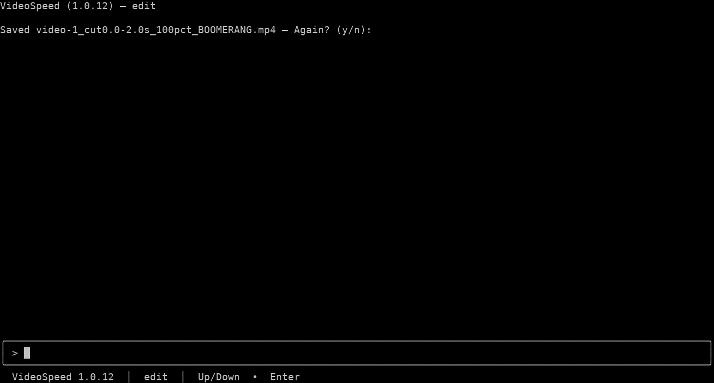

### `self-management.png`

Row **8** has opened self-management. **82 version** is highlighted: “show the installed version.” Then **83 about** “version, FFmpeg, and OpenCV”, **84 version-check** “compare this install with pip”, **85 self-update** “upgrade this package with pip”, **86 self-uninstall** “remove this package with pip”, **87 self-install** “install this package with pip”, and **0 Back** “return to the main menu.” The path label is `Path`, and the status line says `self-management`.

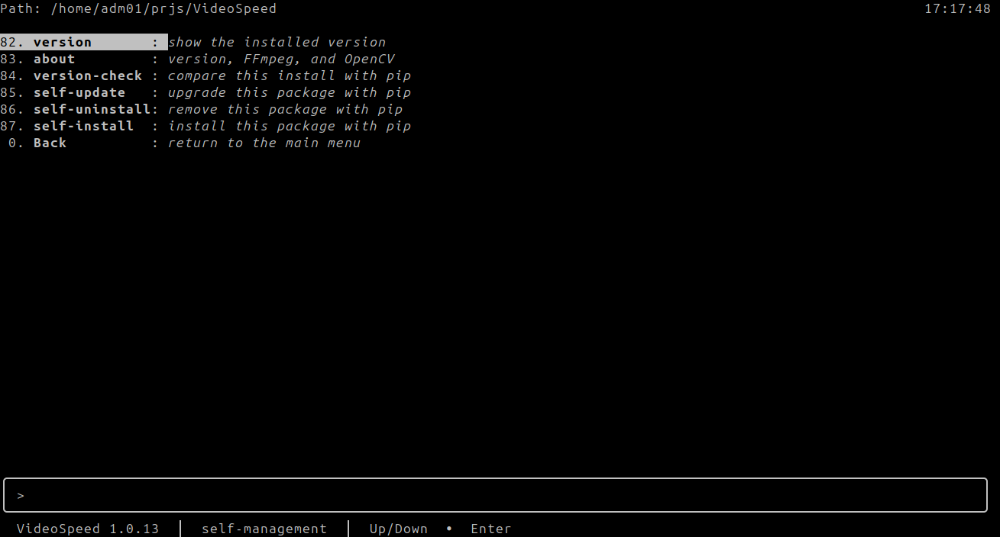

### `tui-about.png`

**about** (83) on the result page. The title is `VideoSpeed (1.0.11) – result`. The page prints `VideoSpeed 1.0.11`, `Domain: Cut → speed/length → optional boomerang for MP4`, `Runtime tools: FFmpeg (encode), OpenCV (duration probe)`, and `Entry points: video-speed, python -m VideoSpeed`. The host check is stamped `2026-10-04 15:05:39.108458` and headed `[CHECK SYSTEM]:`. Visible lines include Python 3.12.11, C Library GCC 13.3.0, Ubuntu 24.04.5 LTS, amd64, the current user, the shell, the Python executable, python2 location, python3 location, conda location, pyenv location, and `Inside docker container: False`. The footer says `Up/Down scrolls this page.` and `Press a key to return to the main menu.` The page stays in English.

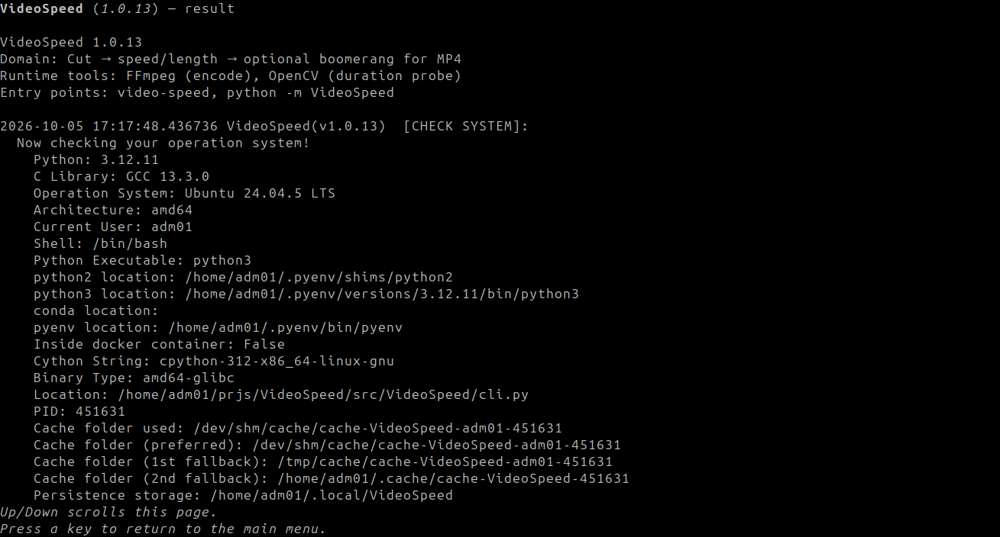

### `video.png`

A still picture. A woman with long brown hair, in a grey shirt with a small blue mark, sits at a round wooden table and holds a white cup. An open book with a worn cover and a metal clasp lies on the table. Behind her are a beige sofa, a wide window onto trees, a potted plant, and a wooden floor in daylight.


## Examples

```bash
# Install editable, then run interactive session in a folder of clips
cd /path/to/videos
video-speed

# Check identity without starting prompts
video-speed --version

# One-shot job (no prompts)
video-speed --file clip.mp4 --start 1.0 --end 5.0 --percent 100
```

Example output name shape:

```text
clip_cut1.0-5.0s_100pct.mp4
clip_cut1.0-5.0s_50pct_BOOMERANG.mp4
```

## Platform Compatibility

| Platform | Status |
|----------|--------|
| Linux | Primary (tested in development) |
| macOS / Windows | Expected to work when Python, FFmpeg, and OpenCV are available |
| Filesystems | Local disk and removable/USB volumes supported for output (temps staged beside final path) |

## Related Projects

- [VideoSpeed on GitHub](https://github.com/Wilgat/VideoSpeed)
- [VideoSpeed on PyPI](https://pypi.org/project/VideoSpeed/)

## Contributing

Fork the repository, use a checkout install (`pip install -e .` or `./setup.sh`), and open a pull request. Prefer small, tested changes. Do not strip defensive temp/publish behavior (cross-filesystem `shutil.move`) without an explicit redesign.

## License

MIT License — see [`LICENSE.md`](LICENSE.md).

## Last Update

2026-10-04 — **1.0.11**: front menu **4** is language. Front **6** is system-log. The first row keeps the path and a local clock. The about page prints PID, the cache chain, persistence, and TTY.
